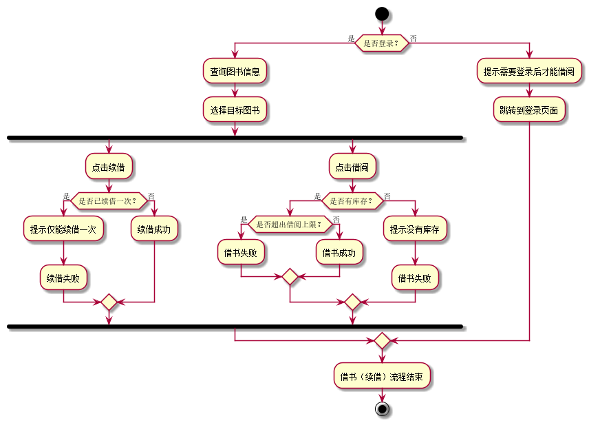

# 1. 图书管理系统PlantUML源码:
```
@startuml
start
left to right direction
skinparam packageStyle rectangle
actor 读者 as d
actor 图书管理员 as t
actor 系统管理员 as x
rectangle 图书管理系统用例图{

    d --> (查询借阅信息)
    d --> (预定图书)
    (预定图书)<..(取消预订):<<include>>
    d --> (借书)
    (借书)<..(续借):<<include>>
    d --> (还书)
    (还书)<..(交罚金):<<extend>>
    d --> (注册)
    d --> (修改个人信息)
    d --> (查询图书信息)
    d --> (登录)

    t --> (修改个人信息)
    t --> (查询图书信息)
    t --> (登录)
    t --> (添加图书)
    t --> (修改（删除）图书)
    t --> (解除预定)
    t --> (允许还书)
    (允许还书)<..(收罚金):<<extend>>
    t --> (允许借书)
    (允许借书)<..(允许续借):<<include>>

    (发布新公告) <-- x
    (管理图书管理员) <-- x
    (管理读者) <-- x
    (维护系统) <-- x
    (登录) <-- x
    (添加图书) <-- x
    (修改（删除）图书) <-- x
}
end
@enduml
```


# 2.“借书和续借”的PlantUML源码：
```
@startuml
    
    start;
    if(是否登录？) then(是)
        :查询图书信息;
        :选择目标图书;
        fork
        :点击续借;
        if(是否已续借一次？) then(是)
            :提示仅能续借一次;
            :续借失败;
        else(否)
            :续借成功;
        endif;
        fork again
        :点击借阅;
        if(是否有库存？) then(是)
            if(是否超出借阅上限？) then(是)
                :借书失败;
             else(否)
                :借书成功;
            endif;
        else(否)
            :提示没有库存;
            :借书失败;
        endif;
        endfork;
    else(否)
        :提示需要登录后才能借阅;
        :跳转到登录页面;
    endif;
    :借书（续借）流程结束;
    stop;
    
    @enduml
 ```

   
# 3.“登录注册”的的PlantUML源码
```
 @startuml
    
    start
    :输入账号;
    :输入密码;
    fork
    :登录;
    :选择读者或管理员身份;
    if(账号是否存在？) then(是)
        if(账号密码是否正确？) then(是)
            :登录成功;
            :进入首页;
         else(否)
            :提示用户账号密码错误;
            :重新登录;
         endif;
    else(否)
        :提示用户账号不存在;
        :重新登录;
    endif;
    fork again
    :注册;
    :再次确认密码;
    :输入验证码;
    if(账号是否存在？) then(是)
        :提示用户账号已存在;
        :注册失败;
    else(否)
        if(两次输入的密码是否相同？) then(是)
            :注册成功;
            :返回登录页面;
        else(否)
            :提示用户两次密码不同;
            :重新注册流程;
        endif;
    endif;
    endfork
    :登录注册流程结束;
    stop;
    
    @enduml
 ```

