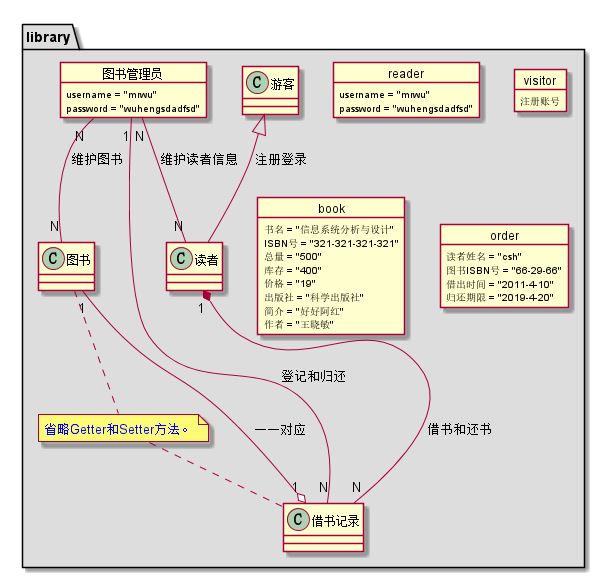

实验三：图书管理系统领域对象建模
----------------
##### 流程一：借书记录
##### uml源码如下
````
@startuml

object order {
	 	读者姓名 = "吴恒"
	 	图书ISBN号 = "11-22-33
	 	借出时间 = "2015-10-10"
	 	归还期限 = "2019-46-20"
}


@endumlml
```
流程三
````
@startuml

	object book {
	 	 书名 = "信息系统分析与设计"
	 	ISBN号 = "123-321-123-321"
	 	总量 = "500"
	 	库存 = "400"
	 	价格 = "19"
	 	出版社 = "科学出版社"
	 	简介 = "读书好，好读书，读好书"
	 	作者 = "王晓敏"
	}

@endumll
````

##### 流程三：游客对象

````
@startuml
 object visitor{
    查询图书信息
    注册账号
 }
@enduml
````


##### 流程四：管理员对象

````
@startuml

object libraryManager {
		 username = "mrwu"
		 password = "wuhengdadsa"
}


@enduml

````
##### 流程五：系统对象

````
@startuml


package "library" #DDDDDD {

object reader {
	 	username = "mrwu"
		password = "wuhengdsafsfa"
	}
	object visitor {
		注册账号
	}

	object 图书管理员 {
		 username = "mrwu"
		 password = "wuhengdsafsfa"
	}


	

	object book {
	 	书名 = "信息系统分析与设计"
	 	ISBN号 = "123-321-121-321"
	 	总量 = "500"
	 	库存 = "400"
	 	价格 = "19"
	 	出版社 = "科学出版社"
	 	简介 = "没得"
	 	作者 = "王晓敏"
	}

	object order {
	 	读者姓名 = "csh"
	 	图书ISBN号 = "66-29-66"
	 	借出时间 = "2018-4-10"
	 	归还期限 = "2018-4-20"
	}

	

}


@enduml
```
##### 记录如下

##### 流程六：系统类
##### uml源码如下
````
@startuml

package "library" #DDDDDD {

	class librarymManager {

		+维护图书()
		+归还图书()
		+借还图书()
		+维护读者信息()
	}
	class reader {

		+查询借阅图书信息()
		+预订图书()
		+取消预订图书()
	}
	class visitor {
		+查询图书信息()
	}

	class book {
	 	-书名
	 	-ISBN号
	 	-总量
	 	-库存
	 	-价格
	 	-出版社
	 	-简介
	 	-作者
	}

	class order {
	 	-读者姓名
	 	-图书ISBN号
	 	-借出时间
	 	-归还期限
	}	 


}


@enduml
````
##### 

##### 流程七：读者对象

```
@startuml
	object reader {
	 	username = "cxz"
		password = "123"
	}
@enduml
````
