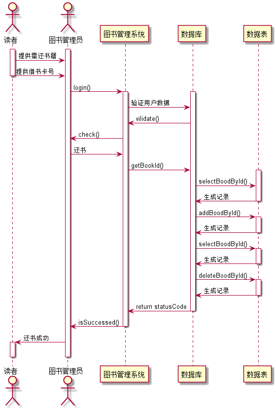

# 实验4：图书管理系统顺序图绘制
|学号|班级|姓名|照片|
|:-------:|:-------------: | :----------:|:---:|
|201510414101|软件(本)15-1|安春生||

## 图书管理系统的顺序图

## 1. 借书用例
## 1.1. 借书用例PlantUML源码

``` 
@startuml
actor  读者 as reader
actor  图书管理员 as manager
activate reader
activate manager
reader->manager:提供需借书籍
reader->manager:提供学生卡号
deactivate reader

manager->图书管理系统:login()
activate 图书管理系统
  activate 数据库
  图书管理系统 -> 数据库:验证用户数据
  数据库 ->  图书管理系统: vilidate()
  manager<-图书管理系统:  check()

  manager -> 图书管理系统 : 借书
  图书管理系统 -> 数据库:  getBookId()
     activate 数据表

     数据库 -> 数据表:     selectBoodById()
     数据表 -> 数据库:     生成记录
     deactivate 数据表

     数据库 -> 数据表:     addBoodById()
     activate 数据表
     数据表 -> 数据库:     生成记录
     deactivate 数据表

     数据库 -> 数据表:     selectBoodById()
     activate 数据表
     数据表 -> 数据库:     生成记录
     deactivate 数据表

     数据库 -> 数据表:     deleteBoodById()
     activate 数据表
     数据表 -> 数据库:     生成记录
     deactivate 数据表


  数据库 -> 图书管理系统:  return statusCode
  deactivate 数据库
  图书管理系统 -> manager: isSuccessed()
  deactivate 图书管理系统

  manager -> reader: 借书成功
  activate reader
  deactivate reader
  deactivate manager

@enduml


```


## 2. 还书用例
## 2.1. 还书用例PlantUML源码

``` 
@startuml
actor  读者 as reader
actor  图书管理员 as manager
activate reader
activate manager
reader->manager:提供需还书籍
reader->manager:提供借书卡号
deactivate reader

manager->图书管理系统:login()
activate 图书管理系统
  activate 数据库
  图书管理系统 -> 数据库:验证用户数据
  数据库 ->  图书管理系统: vilidate()
  manager<-图书管理系统:  check()

  manager -> 图书管理系统 : 还书
  图书管理系统 -> 数据库:  getBookId()
     activate 数据表

     数据库 -> 数据表:     selectBoodById()
     数据表 -> 数据库:     生成记录
     deactivate 数据表

     数据库 -> 数据表:     addBoodById()
     activate 数据表
     数据表 -> 数据库:     生成记录
     deactivate 数据表

     数据库 -> 数据表:     selectBoodById()
     activate 数据表
     数据表 -> 数据库:     生成记录
     deactivate 数据表

     数据库 -> 数据表:     deleteBoodById()
     activate 数据表
     数据表 -> 数据库:     生成记录
     deactivate 数据表


  数据库 -> 图书管理系统:  return statusCode
  deactivate 数据库
  图书管理系统 -> manager: isSuccessed()
  deactivate 图书管理系统

  manager -> reader: 还书成功
  activate reader
  deactivate reader
  deactivate manager


@enduml

```


