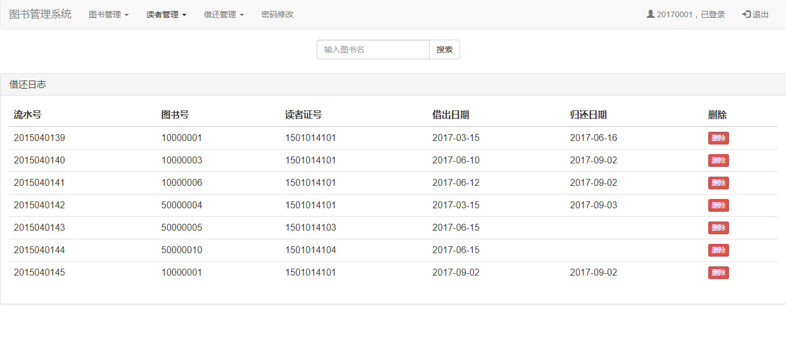

实验五  图书管理系统 
==
项目传送门
<https://github.com/748580573/is_analysis/tree/master/test5/src/main>
##界面
````
登陆界面
````

````
读者管理界面
````

````
借书记录
````

````
密码修改界面
````

````
图书查询
````

- - -
##类图
````
系统类图
````

````
数据库表
````

````
关系图
````

````
管理员
````

````
读者
````

````
图书
````

````
图书记录
````

