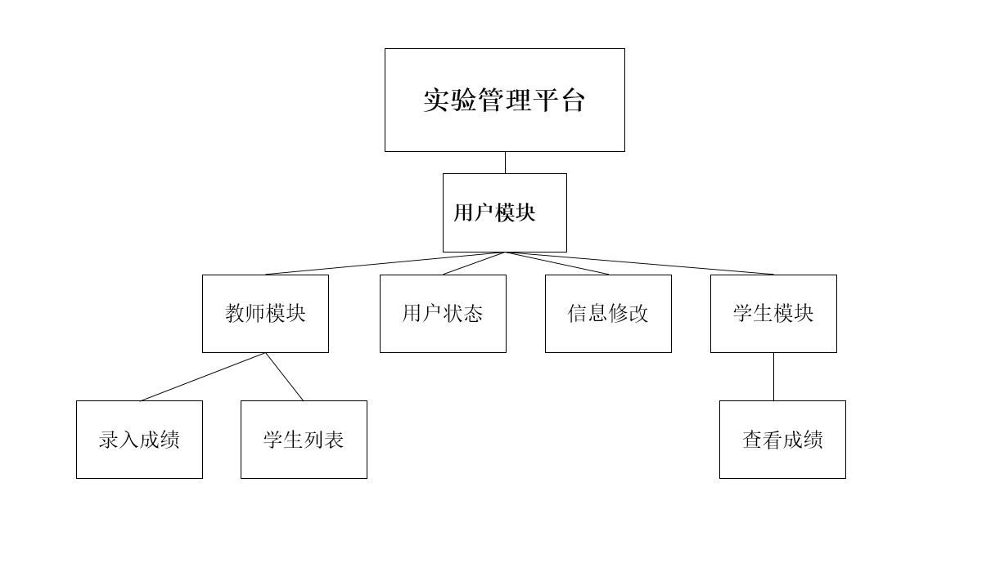
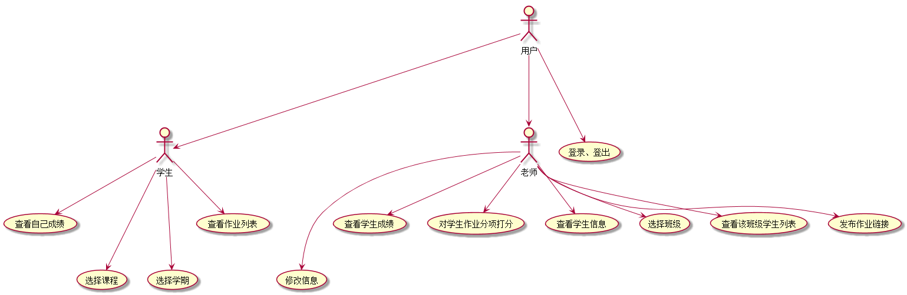
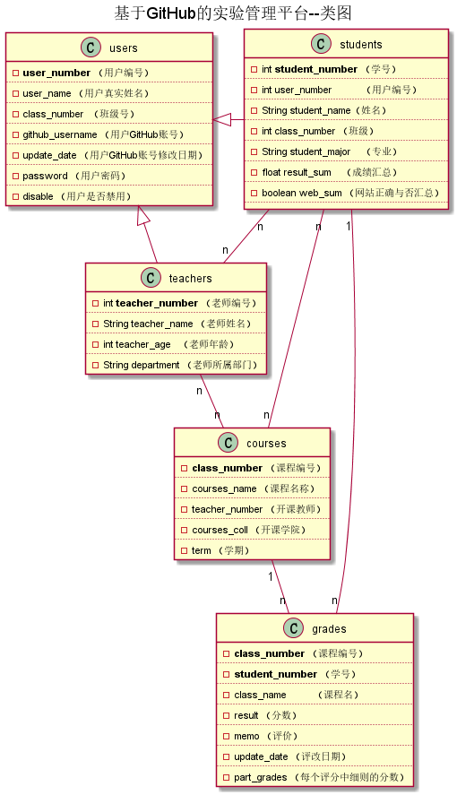

# 基于GitHub的实验管理平台的分析与设计

### 成都大学信息科学与工程学院

|学号|班级|姓名|照片|
|:-------:|:-------------: | :----------:|:---:|
|201510414418|软件(本)15-4|吴恒||

## 1. 概述
- 基于GitHub的实验管理平台的作用是在线管理实验成绩的Web应用系统。学生和老师的实验内容均存放在GitHUB
  页面上。
- 学生的功能主要有：一是设置自己的GitHub用户名，二是查询自己的实验成绩。学生的GitHub用户名是公开的，但成绩不公开。
- 老师的功能主要有：一是批改每个学生的成绩，二是查看每个学生的成绩。
- 老师和学生都能通过本系统的链接方便地跳转到学生的每个GitHUB实验目录，以便批改实验或者查看实验情况。
- 实验成绩按数字分数计算，每项实验的满分为100分，最低为0分。
- 系统自动计算每个学生的所有实验的平均分。
- 该基于Github的实验管理平台的主要作用是方便学生提交和老师批改作业，实现了去中心化。
- 老师可以在该平台查看每一个学生每一学期的每门课程,每一个实验的情况，并根据每一个部分的完成度打分，
- 学生之间也可以互相查看实验，但不能互相看到分数。
- 一个老师可以上多门课，每个老师只能维护老师自己的课程及成绩。
- 一人同学可以上多门课，每个同学只能查询同学自己的课程的实验成绩。
- 老师和同学都可以选多门课程，但必须是老师先选，学生后选。
- 每个实验的实验成绩细分为多个评分项，每个评分项对应各自的评分标准。
## 2. 系统总体结构

## 3. 用例图设计 [源码](Usecase.puml)

## 4. 类图设计 [源码](class.puml)

## 5. 数据库设计
###    [数据库设计](database.md)
## 
用户表

| 字段  | 类型 | 主键、外键 | 可以为空 |默认值| 约束 | 说明 |
|:---:  | :---:|   :---:    |  :-----------:  |:---: | :---: | :---: |
|user_number     | NUMBER(8,0)   |  主键 | 否 | 无 | 无 |  用户编号|
|class_number    |NUMBER(8,0)    | 外键  |否  |无  |无  |  班级号(班级表外键)  |
|user_name       |varchar(20byte)|无     |  否|  无 |无  |   用户名  |
|github_username |varchar(20byte)|无     |  否|  无 |无  |  github账号 |
|update_date     |DATE           |否     |  否|  无 |无  |  用户密码修改时间|
|password     |VARCHAR2(512 BYTE)|否     |  否|  无 |无  |  用户密码 |
|disable      |VARCHAR2(20 BYTE) |否     |否  | 无  |无  |用户是否禁用

## 
教师表

| 字段  | 类型 | 主键、外键 | 可以为空 |默认值| 约束 | 说明 |
| :---:  | :---:  |  :---:     |   :---------:   | :---: | :---: |:---: |
|teacher_number|NUMBER(8,0)|主键|否|无|无|教师编号|
|user_number|NUMBER(8,0)|外键|否|无|无|用户编号，用户表外键|
|teacher_name|varchar(24byte)|无|否|无|无|教师姓名|
|department  |varchar(32byte)|无|否|无|无|教师所在部门|

## 
学生表

| 字段  | 类型 | 主键、外键 | 可以为空 |默认值| 约束 | 说明 |
|  :---:  | :---:  |  :---:   |  :-----------:   | :---:  | :---: | :---: |
|student_number|NUMBER(8,0) |主键|否|无|无|学生学号|
|user_number|NUMBER(8,0)|外键键|否|无|无|用户表外键|
|student_name|varchar(20byte)|无|否|无|无|学生姓名|
|class_number|NUMBER(8,0)|无|否|无|无|班级号|
|student_major|varchar(32byte)|无|否|无|无|课程|
|web_sum|VARCHAR(400 BYTE)|无|否|无|无|GitHub网址是否正确，用逗号分开，Y代表正确，N代表不正确。第1位代表总的GitHUB地址是否正确，第2位表示第1次实验的地址，第3位表示第2位实验地址，依此类推。比如：“Y,Y,Y,Y,Y,N”表示第5次实验地址不正确，其他地址正确|

## 
成绩表

| 字段  | 类型 | 主键、外键 | 可以为空 |默认值| 约束 | 说明 |
|:---:    | :---:  |    :---:     |   :---------:   | :---:   | :---: | :---: |
|class_number|NUMBER(8,0)|主键|否|无|无|课程编号|
|student_number|NUMBER(8,0)|外键|否|无|无|学生编号（学生表外键）|
|class_name|varchar(32byte)|无|否|无|无|课程名|
|result | float|无|否|无|无|成绩分数|
|memo   |varchar(400byte)|无|否|无|无|评价|
|update_date|Date|无|否|无|无|成绩修改时间|

## 
课程表

| 字段  | 类型 | 主键、外键 | 可以为空 |默认值| 约束 | 说明 |
|:---:    | :---:  |    :---:     |   :---------:   | :---:   | :---: | :---: |
|class_number|NUMBER(8,0)|主键|否|无|无|课程编号|
|teacher_number/NUMBER(8,0)|外键|否|无|无|教师编号|
|courses_coll|NUMBER(8,0)|外键|否|无|无|开课学院号|
|courses_name|varchar(32byte)|否|否|无|无|课程名|

## 
学生-课程中间表

| 字段  | 类型 | 主键、外键 | 可以为空 |默认值| 约束 | 说明 |
|:---:    | :---:  |    :---:     |   :---------:   | :---:   | :---: | :---: |
|id|int |主键|否|无|无|主键id无意义|
|student_number|NUMBER(8,0)|外键|无|无|无|学生表外键|
|class_nubmer|NUMBER(8,0)|外键|无|无|无|课程表外键|

## 
学生-教师中间表

| 字段  | 类型 | 主键、外键 | 可以为空 |默认值| 约束 | 说明 |
|:---:    | :---:  |    :---:     |   :---------:   | :---:   | :---: | :---: |
|id|int |主键|否|无|无|主键id无意义|
|student_number|NUMBER(8,0)|外键|无|无|无|学生表外键|
|teacher_number|NUMBER(8,0)|外键|无|无|无|教师表外键|

## 
教师-课程中间表

| 字段  | 类型 | 主键、外键 | 可以为空 |默认值| 约束 | 说明 |
|:---:    | :---:  |    :---:     |   :---------:   | :---:   | :---: | :---: |
|id|int |主键|否|无|无|主键id无意义|
|class_number|NUMBER(8,0)|外键|无|无|无|课程表外键|
|teacher_number|NUMBER(8,0)|外键|无|无|无|教师表外键|

## 
学生-成绩

|id|int |主键|否|无|无|主键id无意义|
|:---:    | :---:  |    :---:     |   :---------:   | :---:   | :---: | :---: |
|student_number|NUMBER(8,0)|外键|无|无|无|学生表外键|
|score_number|NUMBER(8,0)|外键|无|无|无|成绩表外键|

     

## 6. 用例及界面详细设计
  ### [学生用例](用例_学生列表.md) 
  ### [查看用例](用例_查看成绩.md)
  ### [评定成绩用例](用例_评定成绩.md)
  ### [登录用例](用例_登录.md)
  ### [用户信息管理用例](用例_用户信息管理.md)
  ### [选课用例](用例_选课.md)

