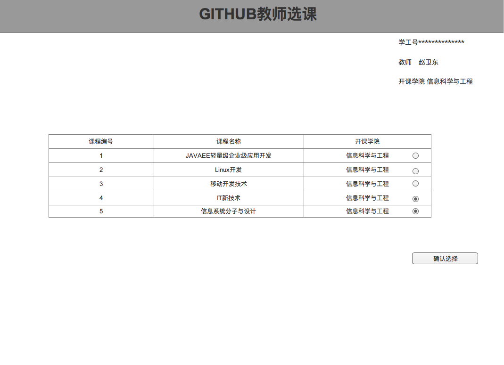

<!-- markdownlint-disable MD033-->
<!-- 禁止MD033类型的警告 https://www.npmjs.com/package/markdownlint -->

# “教师选课”用例 [返回](../README.md)
## 1. 用例规约

|用例名称|教师选课|
|-------|:-------------|
|功能|选择课程|
|参与者|教师|
|前置条件|必须先登录|
|后置条件|老师必须先选了这么课后，其学生才能选|
|主事件流|老师勾选要开的课程后，确认选课|
|备选事件流|在老师没有开的课程里，不能选择课程|

## 2. 业务流程
无

## 3. 界面设计
 
- API接口调用
    
    # 接口：setTeacherCourses  [返回](../README.md)
    
    - 功能：
        教师选择课程进行教学活动。
        
    - 权限：
        老师：可以查看自己已选课程所有学生的选课情况。
        
    - API请求地址： 
        接口基本地址/ui/setTeacherCourses
    
    - 请求方式 ：
        POST
     
    - 请求实例：  
            { 
                "teacher_id": "123456",
                "total": 4,
                "data": [
                    {
                    "courses_id":1,
                    "courses_name":信息系统分析与设计, 
                    "courses_coll":"信息科学与工程学院",
                    }, 
                    {
                    ...其他课程
                    }
                ] 
            }
    
    - 请求参数说明:       
     
      |参数名称|说明|
      |:---------:|:--------------------------------------------------------|      
      |teacher_id|教师编号|
      |total|本次显示的课程信息|
      |data|课程信息|
      |courses_id|课程编号|
      |courses_name|课程名字|
      |courses_coll|开课学院| 
      
      
     
    返回实例：
    
            {         
                "status": true,
                "info": null
            }
    
    - 返回参数说明：    
     
      |参数名称|说明|
      |:---------:|:--------------------------------------------------------|      
      |status|bool类型，true表示正确的返回，false表示有错误|
      |info|返回结果说明信息|
    
    

## 4. 算法描述 
   - 无
## 5. 参照表
COURSES
SEMESTERS

